# Active Learning for Open-set Annotation

PyTorch implementation of
["**Active Learning for Open-set Annotation**"](
Accepted by CVPR2022）


## 1. Requirements
### Environments
Currently, requires following packages.

- CUDA 10.1+
- python == 3.7.9
- pytorch == 1.7.1
- torchvision == 0.8.2
- scikit-learn == 0.24.0
- tensorboardx == 2.1
- matplotlib  == 3.3.3
- numpy == 1.19.2
- scipy == 1.5.3


### Datasets 
For CIFAR10 and CIFAR100, we provide a function to automatically download and preprocess the data, you can also download the datasets from the link, and please download it to `~/data`.
* [CIFAR10](https://www.cs.toronto.edu/~kriz/cifar-10-python.tar.gz)
* [CIFAR100](https://www.cs.toronto.edu/~kriz/cifar-100-python.tar.gz)
* [TinyImagenet](http://cs231n.stanford.edu/tiny-imagenet-200.zip)

## 2. Get started
Zip this repo and run the code
```bash
$ cd LfOSA
```

## 3. Training baselines
run the code
```bash
$ python AL_center.py --gpu 0 --save-dir log_AL/ --weight-cent 0 --query-strategy uncertainty --init-percent 8 --known-class 20 --query-batch 1500 --seed 1 --model resnet18 --dataset cifar100
```
* **Option** 
* --datatset: cifar10, cifar100 and TinyImagenet.
* In our experiment, we set --init-percent 8 in CIFAR100, TinyImagenet and --init-percent 1 in CIFAR10. 
* We set --query-batch 1500 and --model resnet18 in all our experiments.
* We set --known-class = 20, 30, 40, 50. And we set --seed = 1, 2, 3, 4.
* The --query-strategy can be selected from random, uncertainty, AV_based, KMeans, BALD.

## 4. Training our LfOSA approach
run the code
```bash
$ python AL_center_temperature.py --gpu 0 --save-dir log_AL/ --weight-cent 0 --query-strategy AV_temperature --init-percent 8 --known-class 20 --query-batch 1500 --seed 1 --model resnet18 --known-T 0.5 --unknown-T 0.5 --modelB-T 1 --dataset cifar100
```
* **Option** 
* --datatset: cifar10, cifar100 and TinyImagenet.
* In our experiment, we set --init-percent 8 in CIFAR100, TinyImagenet and --init-percent 1 in CIFAR10. 
* We set --query-batch 1500 and --model resnet18 in all our experiments.
* We set --known-class = 20, 30, 40, 50. And we set --seed = 1, 2, 3, 4.


## 5. Evaluation
To evaluate the proformance of LfOSA, we provide a script to plot experimental results as shown in `plot.py`, run this command:

```bash
$ python plot.py
```

## 6. Results of CIFAR10 (first row) and CIFAR100 (second row)
After running process 3, 4, 5, we can obatain the following results.
### **Selection Recall**
<div align="center">
  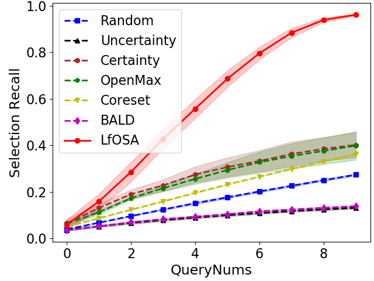
  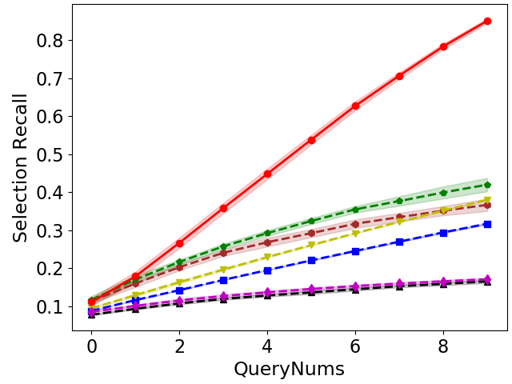
  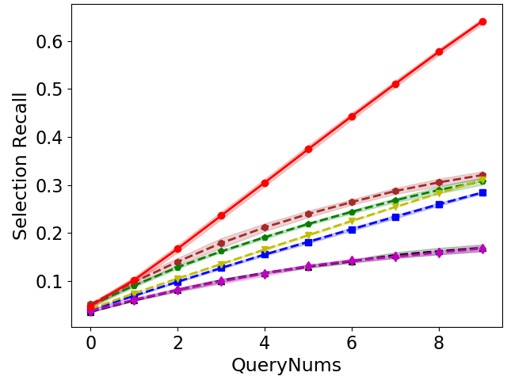
  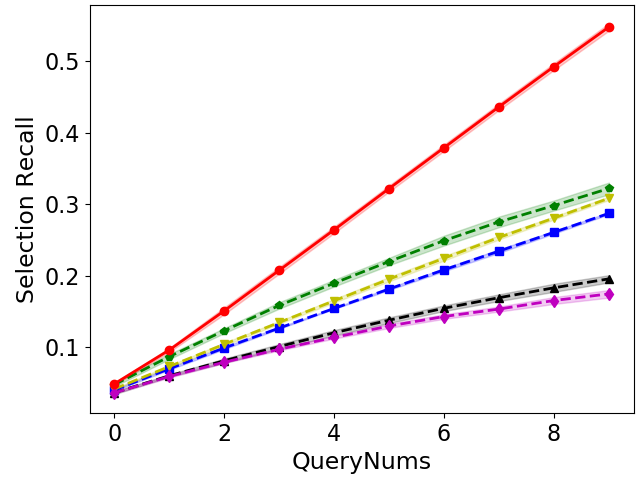
  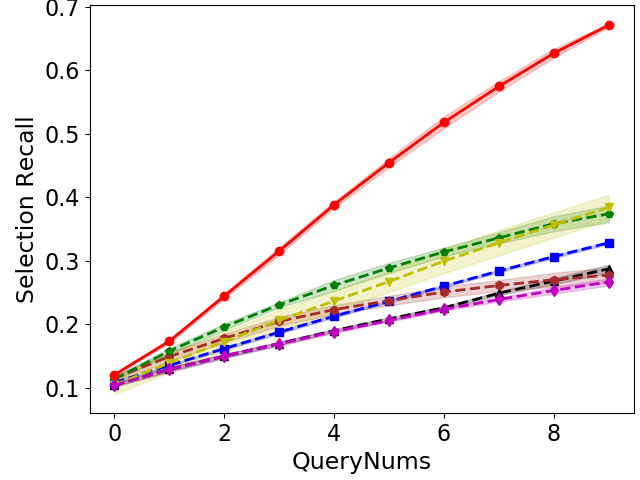
  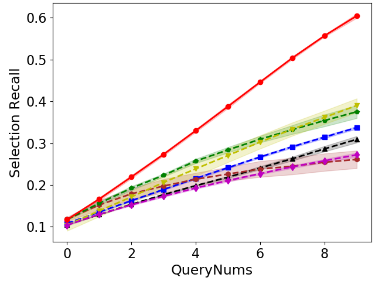
  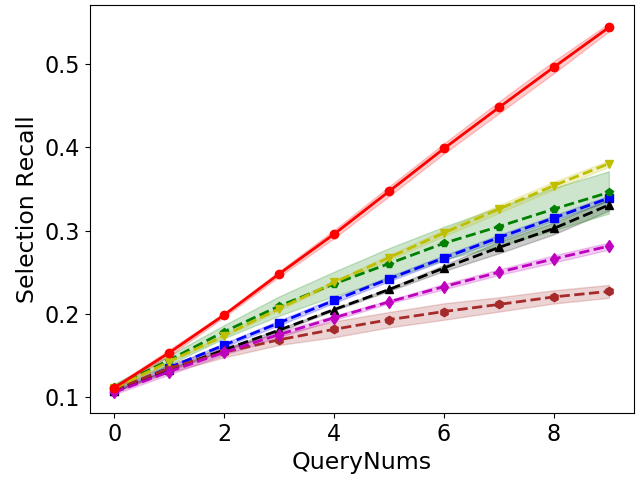
  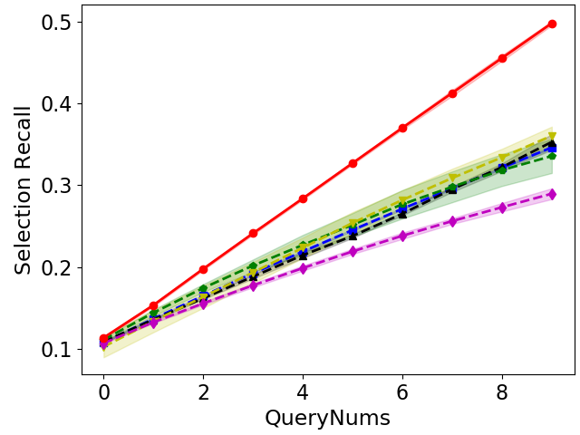
</div>

### **Selection Precision**
<div align="center">
  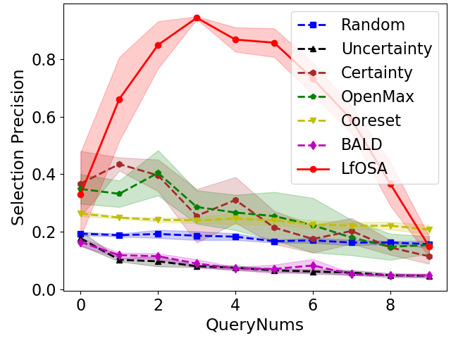
  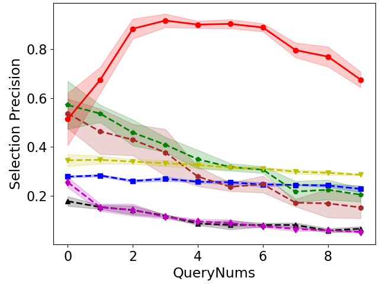
  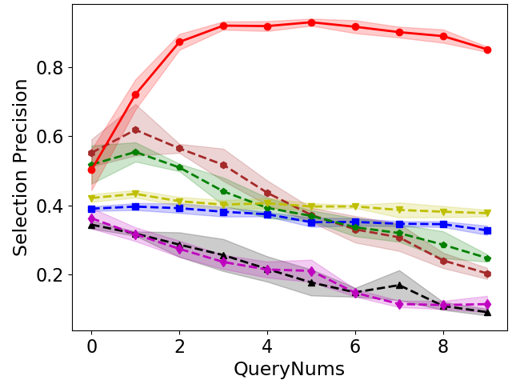
  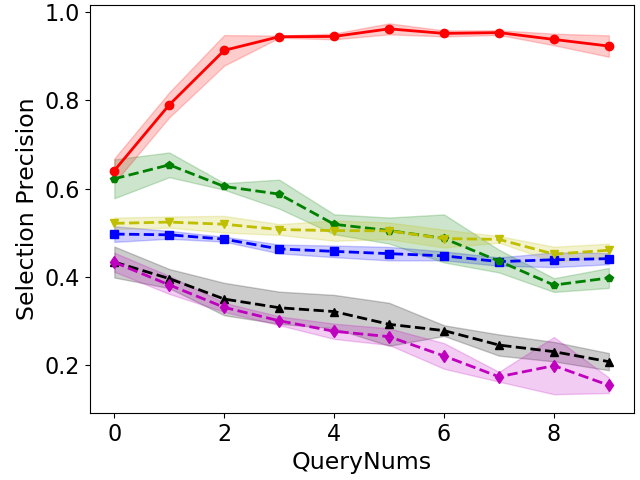
  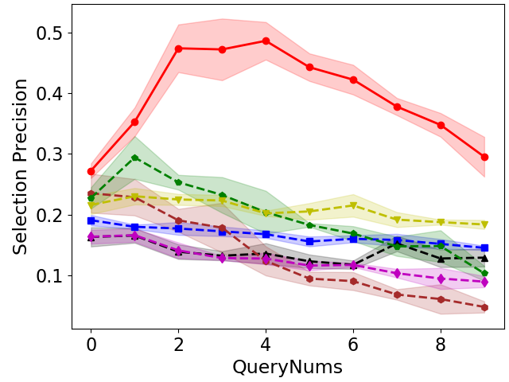
  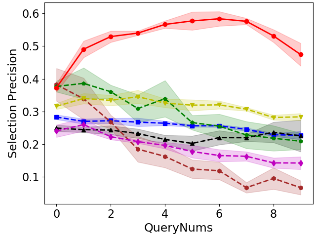
  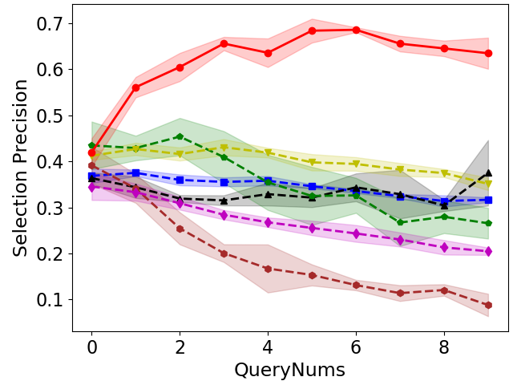
  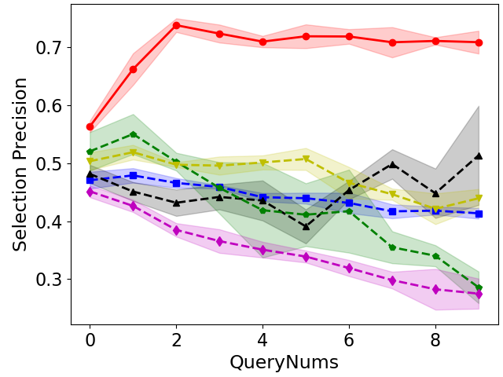
</div>

### **Classification Accuracy**
<div align="center">
  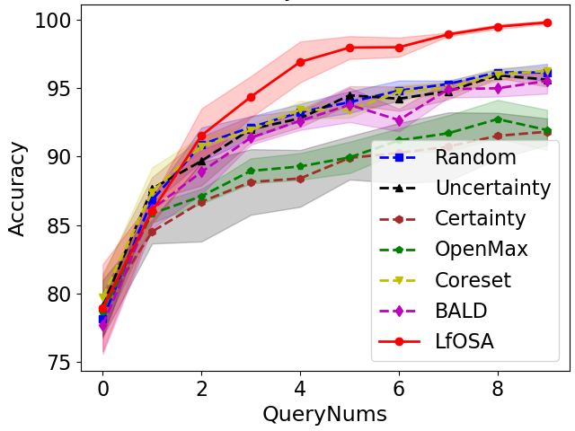
  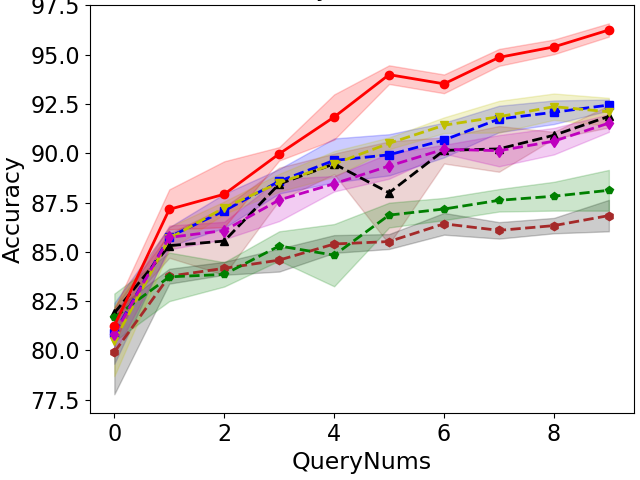
  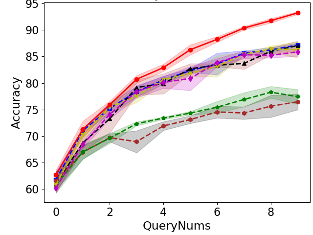
  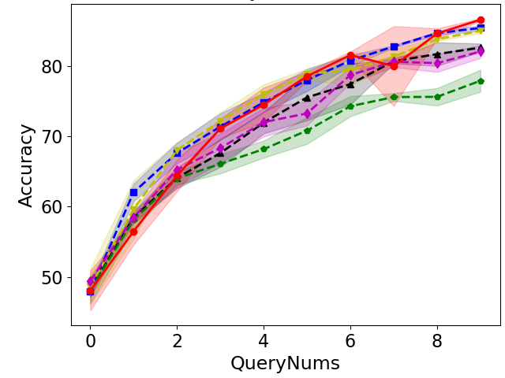
  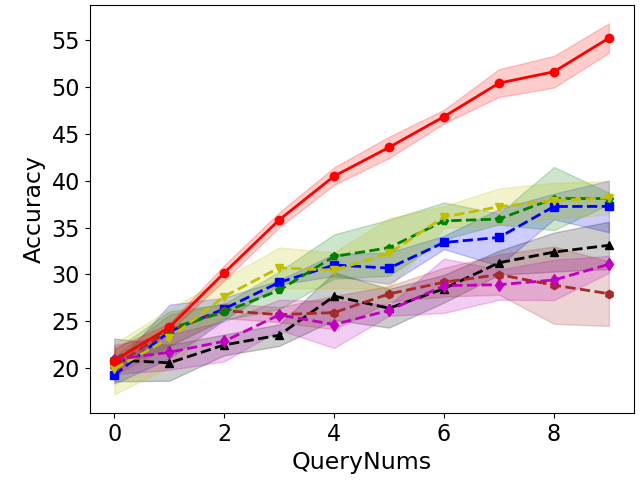
  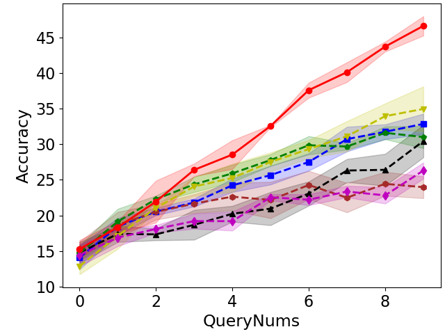
  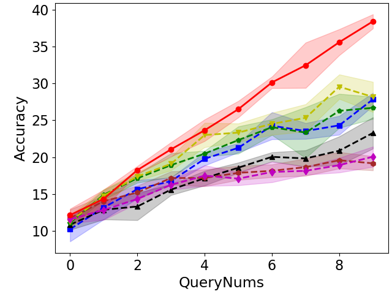
  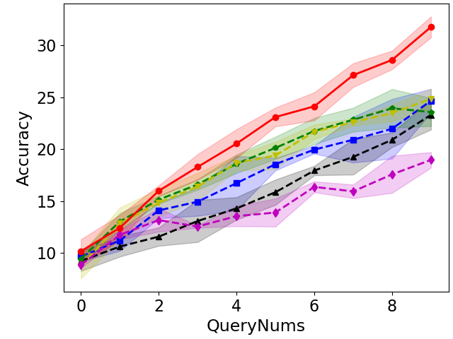
</div>